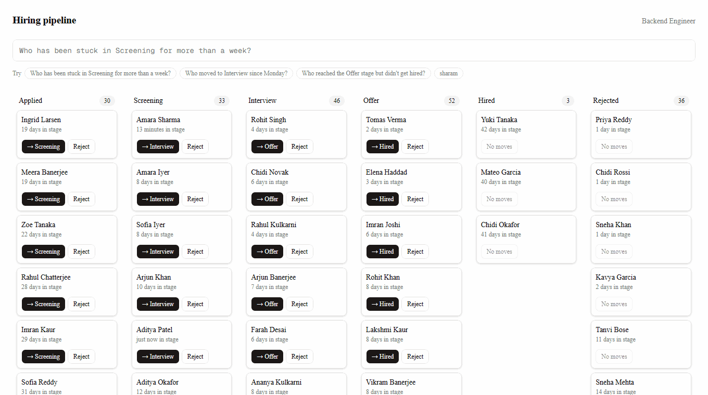
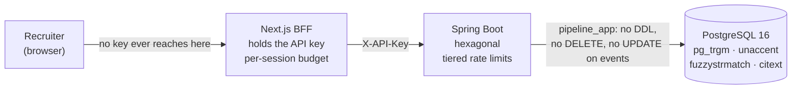

# Hiring pipeline

One job opening, six stages, an append-only history, and a search box that explains itself.



## Run it

```bash
docker compose up
```

Then <http://localhost:3000>. It seeds 200 candidates with backdated histories, so the
board and every example query below have something to show. Nothing else to configure; set
`API_KEY` if you want a real one.

```
make up      # the same thing
make test    # both suites
make down
```

## What it is

A recruiter's pipeline for one opening. Six columns, drag-free: each card offers the moves
that candidate actually has, and none that it does not. Every move appends to a history
that cannot be edited — not by the UI, not by the API, and not by the application's own
database role.

The search box takes English. "Who has been stuck in Screening for more than a week?"
becomes `stage:screening in_stage_for:>7d`, and shows you that it did, as chips under the
box, before you trust the results.

## Architecture



Dependencies point inward: `domain` knows nothing about Spring, JPA or HTTP; `application`
owns the ports; `infrastructure` and `api` are adapters. ArchUnit fails the build if that
stops being true. Full diagrams — context, components, ERD, the search pipeline, and a
transition's transaction boundary — are in **[docs/architecture.pdf](docs/architecture.pdf)**,
rendered from the Mermaid sources in [docs/architecture.md](docs/architecture.md).

## Search, briefly

Full reference: **[docs/search-grammar.md](docs/search-grammar.md)**. The short version:

| Field | Means | Example |
|---|---|---|
| `stage` | where they are now | `stage:interview` |
| `reached` | ever entered that stage | `reached:offer` |
| `moved_to` + `since` / `before` | a move, optionally bounded | `moved_to:interview since:monday` |
| `in_stage_for` | how long they have been there | `in_stage_for:>7d` |
| `applied` | how long ago they applied | `applied:<30d` |
| `status` | `hired`, `rejected`, `active` | `-status:rejected` |
| `name` / `name_like` | fuzzy, and fuzzier | `name_like:pryia` |
| `source` | where they came from | `source:referral` |
| a bare word | the name fuzzily, the email exactly | `sharam` |

Durations take `7d`, `2w`, `3mo` or words (`a week`, `more than three days`). Dates take
ISO, `today`, `monday`, `last monday`, `this week`. Everything relative resolves against an
injected clock, so it means the same thing in a test as in production —
`GET /api/v1/search/explain?q=…` shows you which instant it picked.

A bad query never returns an empty list. It returns the character range that is wrong, and
what to type instead. A *valid* query that matches nobody returns alternatives, each a
complete query returning exactly the count it promises.

## Decisions

**Hexagonal, and enforced.** The interesting part of this system is a set of rules, and the
usual Spring layering puts them in a class that also holds a repository and a `Clock`
injected by a framework. Here the domain is plain Java with no annotations, which is why it
sits at 100% line coverage without anybody working at it. The layering also makes "what if
Postgres trigram is not enough" answerable: `CandidateSearch` is a port, so an OpenSearch
implementation is a new class in `infrastructure` and no change to the domain, the use
cases, or the parser. That is what the indirection is for; it costs more files than a
three-layer version, which is a real cost, accepted deliberately.
[ADR 0001](docs/adr/0001-hexagonal-architecture.md)

**A hand-written parser, not a language model.** An LLM would have taken an afternoon and
been the wrong tool, because the requirement is not understanding the sentence — it is
telling her precisely why a query is invalid. `stage:Intervew` comes back as
`UNKNOWN_STAGE`, span `[6,14]`, `didYouMean: ["Interview"]`, and the box underlines exactly
those eight characters. A model has no stable notion of where in the input it went wrong,
and would have invented an interpretation rather than rejecting bad input — which is the
one failure this feature cannot have. The cost is that the language is only as wide as the
rewrite table: a sentence it does not recognise is searched as a name rather than guessed
at. [ADR 0002](docs/adr/0002-deterministic-parser-over-llm.md)

**The audit trail is enforced three times, and only the third one counts.** Hibernate
`@Immutable` stops the ORM writing an `UPDATE`. A trigger stops the database accepting one
— including a separate statement-level trigger for `TRUNCATE`, which row-level triggers do
not fire on. And the application connects as `pipeline_app`, which holds `SELECT, INSERT`
on `stage_event` and no DDL at all, so it cannot drop the trigger that constrains it.
Enforcing immutability in application code is the normal approach and is worth roughly
nothing; anyone with the connection string can `UPDATE`. The integration tests connect as
`pipeline_app` too, so a missing grant fails in CI rather than in production.
[ADR 0003](docs/adr/0003-append-only-events-in-the-database.md)

**`current_stage` is denormalised, and a transaction plus a rebuild endpoint keep it
honest.** The log is the truth, but "where is everyone now" is a window function over the
whole log and the board would run it on every page load. So `current_stage`,
`current_stage_since` and `reached_mask` live on `candidate`, written in the *same
transaction* as the event that moves them — they cannot diverge through a failure. And
`POST /api/v1/admin/rebuild-projections` recomputes all of them from the log and reports
how many differed. That number is the drift figure, it should always be zero, and it is
safe to run at any time because the log is immutable and this only rewrites the cache of
it. [ADR 0004](docs/adr/0004-projection-and-reached-mask.md)

**`reached_mask` exists because "reached Offer but was never hired" is the question the
projection cannot answer.** `current_stage` knows where someone is, not that they passed
through Offer in March and were rejected in April. A bitfield of every stage ever entered
turns that into a predicate on one row instead of a semi-join against the whole event log:
8.4 ms against 11.3 ms at 50k rows, and the gap widens as histories grow, because the mask
is one row per candidate however many events they accumulate. The bits are declared on the
`Stage` enum rather than derived from the ordinal, so inserting a stage mid-pipeline cannot
silently renumber every mask already stored.

**Keyset pagination, because OFFSET is wrong in a way tests rarely catch.** A candidate
added while the recruiter is between pages shifts everything down, so page two re-shows a
row she has seen or skips one she has not. The cursor is the position she stopped at —
`(created_at, id)` for the list, `(score, created_at, id)` for a ranked search, since six
people called Sharma score identically against "sharam" and a non-unique key would skip at
the boundary. The two cursor kinds are tagged, so feeding one to the other fails rather
than silently paging through the wrong ordering.
[ADR 0005](docs/adr/0005-keyset-pagination.md)

**Rate limits tiered by cost, not one global number.** A board read is one indexed query; a
search parses, scans trigrams and scores every match; a transition writes two rows and takes
a lock. One number forces you to either throttle the cheap thing to protect the expensive
one, or leave the expensive one unprotected. Three buckets — 20/min write, 300/min read,
60/min search — and the tier is chosen by what the request *does*: a `q=` on the candidates
list costs the same scan as `/search/explain` and is charged to the same bucket, rather than
to the read tier it happens to be mapped under. [ADR 0006](docs/adr/0006-tiered-rate-limiting.md)

## Trade-offs I accepted

**Coverage is gated at 85% on `domain` and `search` only, and nowhere else.** That is
deliberate, not an oversight. Those two are where the rules and the logic live and are pure
enough that a gap means a behaviour nobody exercised; they currently sit at 100%, 97% and
96%. Everywhere else is adapters, DTOs and wiring, where a coverage number measures how much
Spring was started, and chasing it buys tests that assert a getter returns what was passed
to it. CI fails if either gated package regresses.

**The backend has no code formatter.** Its lint is architectural: ArchUnit fails the build
on a domain that reaches for Spring, a use case that reaches for an adapter, or a query
pipeline that learns a field's name. Adding Spotless now would reformat every file in the
repository to satisfy a tool that has never had an opinion about it — churn, not a check.
The frontend has ESLint and `tsc --noEmit` because they came with it.

**One job opening is assumed throughout.** `JobReader.singleJobId()` is called by every
read path. Multi-tenancy is a schema change, not a scaling knob.

**The BFF's per-session limit is in process.** It resets on restart and is not shared
between replicas, so a second frontend container would give each session two budgets. It is
not the limit protecting the database — the backend's key-level limit is — it exists so one
tab in a render loop cannot spend the shared key's budget and 429 everybody else.

**`reached:` is a sequential scan and stays one.** `&` is not a searchable operator, so the
planner never picks a btree on `reached_mask`. 10 ms at 50k, mid-pack next to 4 ms for
`stage:` and 149 ms for a name search. The enumerated-mask rewrite that *would* be indexable
is measured and written down; it is not built because it is not where the time goes.

**No caching of search results, no query history, no saved searches, no materialised
views.** If Postgres trigram stops being enough it is an adapter swap, and that belongs in
this README rather than in speculative code.

## What I would do with more time

Each of these was considered and deliberately left out. What matters is that none of them
needs the design to change.

**A tamper-evident hash chain over events.** Each row hashing the previous row's hash, plus
`GET /api/v1/audit/verify` walking the chain and reporting the first break. Today's
guarantee is that the database refuses edits; a chain would make an edit *detectable* even
if someone got around the database — a different and stronger claim. Not built because at
this size the three existing layers already exceed what the threat model justifies.
`stage_event` is append-only with a per-candidate `seq`, so the chain is two columns and a
trigger, and the rows to hash are already in a defined order.

**Real JWT auth, with login and refresh.** There is one recruiter and a static API key
today. `CurrentActor` is already the single seam that produces the identity stamped on every
event, so this is an implementation of that interface plus a filter — no call site changes,
because nothing downstream asks where the actor came from.

**Multiple recruiters and multiple jobs, with tenancy scoping.** The honest one. Every read
path calls `JobReader.singleJobId()`, so this is a real change: a tenant column, a filter in
every field handler, row-level security, and a decision about what a recruiter may see
across jobs. The schema already carries `job_id` on `candidate` and the indexes already lead
with it, so the query shapes survive; the API and the ports do not.

**Playwright end-to-end tests.** The search bar has component tests and the eight acceptance
queries are verified through HTTP, but nothing drives a real browser through the optimistic
move and its rollback. The demo GIF is recorded by a Puppeteer script, so the machinery for
driving the app is already here; it asserts nothing, which is the gap.

**k6 load testing with a real p95.** Every number quoted here is a single `EXPLAIN ANALYZE`
on one machine, not a percentile under concurrency. The interesting one would be search
under load, because ranking scores every match before the top-N sort and that cost grows
with the result set rather than the table.

**An outbox table for downstream events.** Writing to it in the same transaction as
`stage_event` and relaying after commit is the standard fix for "the event was published but
the transaction rolled back". Not needed because nothing consumes these events yet. The
write path is already one transaction through `CandidateWriter`, which is the only place an
outbox insert would go.

**Monthly partitioning on `stage_event`.** Straightforward precisely because the table is
append-only: no row ever moves between partitions after it is written. It is always queried
by `candidate_id` or by `(to_stage, occurred_at)`, both of which partition cleanly by month.
A migration, not a redesign.

**Read replica routing.** Reads go through `CandidateReader` and `CandidateSearch` and never
write — split from `CandidateWriter` for exactly this reason. Routing them is a second
`DataSource` and a `@Transactional(readOnly = true)` router, with no change above the
adapter.

**OpenSearch, at a scale Postgres trigram would not hold.** This is the point of the
layering, so it is worth being specific. `CandidateSearch` is a port in `application` with
four methods; `JpaCandidateSearch` implements it. An OpenSearch adapter is a new class
implementing the same interface. The domain does not change, the use cases do not change,
and — the part that matters — **the parser does not change**, because it produces an AST,
not SQL. `SpecificationBuilder` would gain a sibling that walks the same AST into a query
DSL, and each `FieldHandler` would supply its own clause exactly as it supplies a Criteria
predicate today. What would need real thought is ranking: the score is computed in SQL so
that results can be keyset-paginated, and OpenSearch scores differently, so `matchedOn` and
the cursor would need rework. That is the honest boundary of "just an adapter swap".

## Things worth knowing about how this was built

Three of these are more useful than the feature list.

### Three checks that could not have failed

Found in three different phases, all the same shape.

An ArchUnit rule matched **zero classes** — `..api..` matches any package with an `api`
segment, including `org.assertj.core.api`, so the rules reported 68 false violations the
moment the domain gained tests, and the corrected form had to be written out fully. A fixed
test clock sat on a **whole second**, so Postgres's microsecond rounding had nothing to
truncate and the test was structurally incapable of catching the bug it existed for. And
metrics assertions ran against `/actuator/prometheus` while Boot **disables metrics export
under test**, so every assertion was asserting against a 404.

A suite that cannot fail is worse than no suite, because it is also a claim. The habit that
caught all three was asking of a green test "what would I have to break for this to go red",
and not being satisfied by "the code".

### Two bugs found by running it, not by testing it

**Postgres stores microseconds and rounds.** A nanosecond `Instant` read back is not even a
prefix of the one written, so two supposedly identical idempotent responses differed in
production while the test passed — the test clock sat on a whole second. Fixed by stamping
events at microsecond resolution in the domain, which holds for every clock including the
ones tests inject.

**`since:monday` found nobody on Mondays.** The seed anchored its recent Interview moves to
midnight and subtracted twelve hours; `since:monday` resolves to midnight on the most recent
Monday, which *is* this morning when today is Monday. So one day in seven, a headline demo
query parsed correctly, ran correctly, and truthfully returned nothing. It was caught by
running the eight acceptance queries through the UI — on a Monday. A query that is right
about a dataset that is wrong looks exactly like a query that is wrong.

A third belongs with them: autocomplete was keyed on the raw input rather than the debounced
value, so it fired once per keystroke and a fifty-character sentence exhausted the backend's
60-per-minute search budget before it was finished. Every test typed into a mock that never
complained; the rate limiter found it the first time a human typed a sentence.

### A number that was wrong by a factor of twenty

The edit-distance retry behind a zero-result suggestion was quoted at **141 ms** at 50k
rows, and a decision to accept its cost was made on that figure. The real cost of the
shipped shape is **3.0 s** — the 141 ms was the raw expression measured inline on a warm
cache, and wrapping it in a SQL function so the typo floor and the retry share one
definition stops Postgres inlining it, turning it into a function call per row. Re-measured,
corrected everywhere, and the decision re-affirmed on the true number: 49 ms at the scale
this actually runs, with a one-second statement timeout so the 50k case degrades into a
missing suggestion rather than a hanging request. Being trusted on numbers depends on
saying when one was wrong.

### An index measured and deliberately not added

At 50k rows, adding the obvious index for the unfiltered list makes the first page **87×
faster** and a deep page **3.7× slower** — 45,286 buffers against 1,724 — because JPQL has
no row-value comparison, so the keyset predicate is written longhand and can only ever be a
`Filter`, never an `Index Cond`. Adding it alone would look like an improvement and measure
as a regression. At seed scale the two are indistinguishable. Not built; the numbers are in
[docs/search.md](docs/search.md) so nobody adds it without also making `pageAfter` native.

### Where the performance numbers come from

Every millisecond figure in this repository comes from `ExplainPassTest`, which **does not
run in a normal build** — it needs 50,000 candidates that no fixture builds, and the suite
reports it as one skipped test among 491 passing ones. The dataset is committed at
`backend/src/test/resources/perf/50k-candidates.sql` and the exact commands are in that
class's javadoc. Treat the numbers as a snapshot, measured once by hand, not as something
re-checked on every commit. They will go stale silently the first time a query shape
changes, and nothing will fail.

### The open/closed claim, tested last

The last thing added was `source:referral`, filtering a column that had been on the table
since the schema and that nothing had ever asked about. The claim under test was that a new
searchable field is one new class.

**The lexer, the parser, the validator, the normaliser, the specification builder, the
ranking and the search service were not touched.** What it actually cost was one new
`FieldHandler`, plus one new variant on the sealed `ResolvedValue` and the two exhaustive
switches that variant forces — because `source` is the first field whose value is an exact
label rather than a person's name, and reusing the fuzzy text value would have scored every
candidate's *name* against the word "referral" and explained the match as
`source ~ 'referral' (0.00)`. Those three one-line edits are the sealed model doing its job:
a new kind of value is a compile error in the places that must handle it, rather than a
silently unhandled case.

It works end to end — parse, SQL, ranking and HTTP — and autocomplete picked it up with no
wiring at all. One test had to change for an honest reason: `FieldRegistryTest` used
`source` as its *hypothetical* new field back when the parser was built, and the registry
correctly refused two handlers claiming one name. It is called `cohort` now.

## Layout

```
backend/     Spring Boot · domain, application, infrastructure, api, search
frontend/    Next.js App Router · BFF route handler, board, search, drawer
docs/        architecture.md + .pdf · search-grammar.md · schema.md · search.md · adr/
docs/tooling/  regenerates the demo GIF and the architecture PDF
```

492 backend tests (one skipped, above), 11 frontend tests. `make test` runs both.
