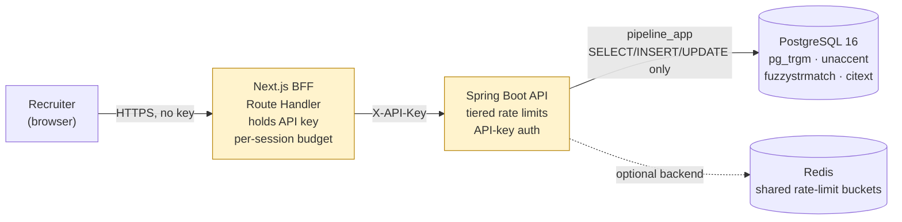
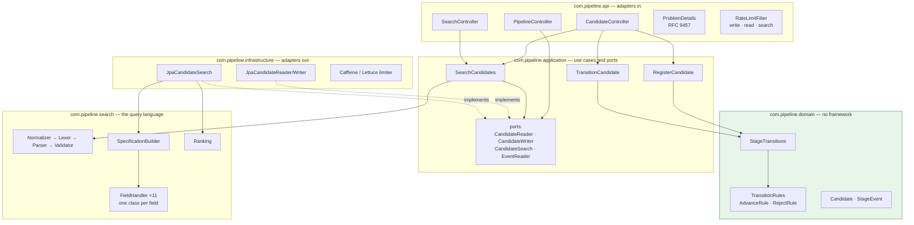
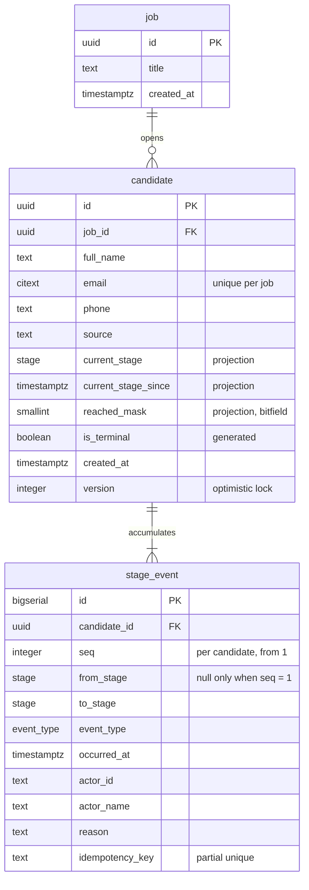
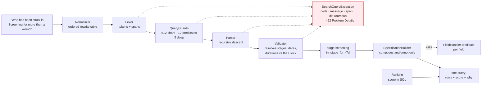
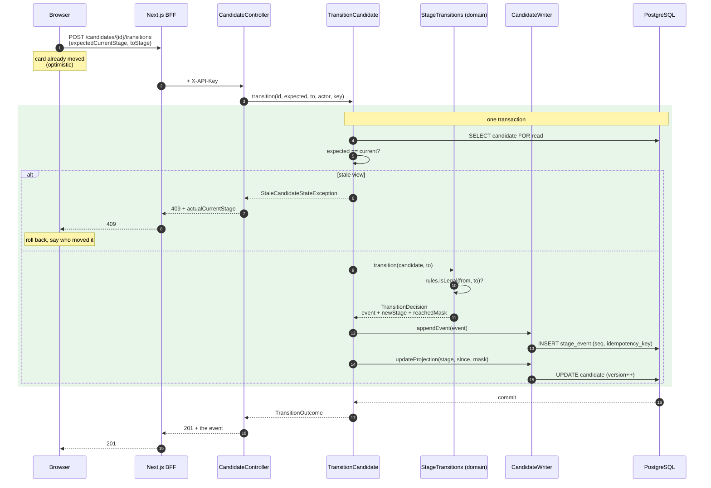

# Hiring pipeline — architecture

One job opening, six stages, an append-only history, and a search box that explains itself.

Source: <https://github.com/RB245/hiring-pipeline>

This document is the source for `architecture.pdf`. The diagrams are Mermaid, so they are
diffable and editable rather than pasted images; `cd docs/tooling && npm run pdf` rebuilds
the PDF from this file.

---

## 1. Context

Who talks to what, and where the secret lives. The browser never reaches Spring: the
Next.js BFF holds the API key, and an endpoint the UI does not use is not reachable
through it.

The two roles matter. Flyway migrates as `pipeline`, which owns the schema; the
application connects as `pipeline_app`, which holds `SELECT, INSERT, UPDATE` on
`candidate`, `SELECT, INSERT` on `stage_event`, and no DDL at all. The application cannot
drop the trigger that stops it rewriting history, because dropping it is DDL.

---

## 2. Components

Ports point inward. The domain knows nothing about Spring, JPA or HTTP, and an ArchUnit
test fails the build if that stops being true.

`CandidateSearch` is a port. Swapping Postgres trigram for OpenSearch is a new class in
`infrastructure` implementing that interface — no change to the domain, the use cases, or
the parser.

---

## 3. Data model

Three tables. `stage_event` is the source of truth; the projection columns on `candidate`
are a cache of it that can be rebuilt at any time.

`reached_mask` is a bitfield of every stage ever entered: APPLIED 1, SCREENING 2,
INTERVIEW 4, OFFER 8, HIRED 16, REJECTED 32. It turns "reached Offer but was never hired"
into a predicate on one row instead of a semi-join against the whole event log.

---

## 4. The search pipeline

No model anywhere in this path. Every stage is deterministic, and every token and node
carries two spans — one into the normalised DSL, one into the characters she typed — which
is what lets the input box underline the exact wrong word.

A zero-result query is re-asked: each top-level condition dropped in turn, and any fuzzy
term retried against `name_like:`, all counted in two passes and offered as complete
queries she can run.

---

## 5. A transition

The only endpoint that mutates pipeline state, and the one place the transaction boundary
matters. The projection update and the event append are the same transaction: either both
happen or neither does, so the cache can never disagree with the log.

Three things are load-bearing here. `expectedCurrentStage` is what makes the optimistic
board safe. The unique index on `(candidate_id, idempotency_key)` makes a retry a no-op
rather than a second event. And `version` on `candidate` makes two simultaneous
transitions resolve as one winner and one 409.

---

## 6. Scalability

What this design does and does not hold, with the numbers that are actually measured. All
figures come from `ExplainPassTest`, which is **skipped in a normal build** — see the
caveat in `docs/search.md`.

**Measured at 50k candidates and 152k events**, on the SQL Hibernate emits:

| Query | Plan | Time |
|---|---|---|
| `stage:interview` | `candidate_stage_idx` | 44 ms |
| `stage:interview in_stage_for:>7d` | `candidate_active_since_idx` | 34 ms |
| `moved_to:interview since:monday` | `stage_event_to_stage_occurred_idx`, semi-join | 0.1 ms |
| `name:sharma` | `candidate_name_trgm_idx` | 149 ms |
| `reached:offer -status:hired` | sequential scan, by design | 65 ms |

**Where it bends first.** Name search is dominated by scoring, not filtering: the indexed
filter is 16 ms and the rest is `candidate_name_score` over every match. Ranking has to
score every match before the top-N sort, so this grows with the size of the result set
rather than the table. The edit-distance retry behind a zero-result suggestion is worse —
3.0 s at 50k — which is why it runs under a one-second statement timeout and is dropped
rather than allowed to hang.

**What the shape already allows.** `stage_event` is append-only and always queried by
`candidate_id` or by `(to_stage, occurred_at)`, so monthly range partitioning is a
migration rather than a redesign. Reads go through `CandidateReader` and `CandidateSearch`
and never write, so routing them to a replica is a connection choice. And the search port
is the reason an OpenSearch adapter would be a new class in `infrastructure` and nothing
else: the domain has never heard of trigrams.

**What it will not hold.** One job opening is assumed throughout — `JobReader.singleJobId()`
is called by every read path. Multi-tenancy means a tenant column, a filter in every
handler, and row-level security; it is a schema change, not a scaling knob.
