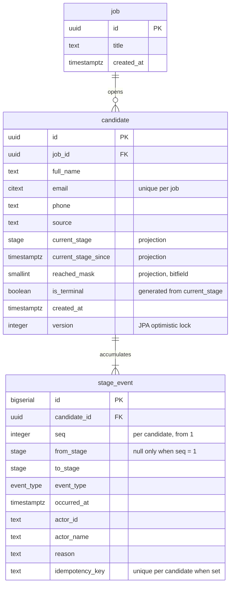

# Schema

Flyway migrations `V2`–`V7` in `backend/src/main/resources/db/migration`. One concern
per migration: extensions, enums, tables, indexes, immutability, roles.

## ERD

`stage_event` is append-only. Neither foreign key cascades, in either direction.

## Immutability

Three layers, each meant to hold if the others are removed:

| Layer | Mechanism | Fails with |
|---|---|---|
| Trigger | `BEFORE UPDATE OR DELETE` and `BEFORE TRUNCATE` on `stage_event` | `P0001` |
| Privilege | `pipeline_app` holds `SELECT, INSERT` only; no DDL | `42501` |
| Referential | no `ON DELETE CASCADE` anywhere | `23503` |

The two SQLSTATEs are distinct on purpose, so the tests can tell which layer stopped a
write and neither can pass by being masked by the other.

`pipeline_migrator` is a NOLOGIN role that owns every table, type and function.
`pipeline_app` is what Spring's datasource connects as. Flyway connects as the
bootstrap superuser, which is a member of `pipeline_migrator` — a migration cannot be
run by a role it is in the middle of creating, so the ownership identity and the
migrating identity are necessarily different things.

## Adding a stage later

Postgres enums can gain values but not lose or reorder them.

Adding one is possible and more flexible than it first appears: `ALTER TYPE stage ADD
VALUE 'TAKE_HOME' BEFORE 'INTERVIEW'` inserts it at the right sort position rather than
appending it, so `ORDER BY current_stage` keeps working. Two constraints to plan for:

- A new value cannot be **used** in the same transaction that adds it. Flyway wraps each
  migration in a transaction, so adding the value and backfilling with it must be two
  migrations.
- Removing or renaming a value is a type rewrite: create the new type, `ALTER TABLE ...
  TYPE ... USING`, drop the old. On a table this size that is minutes of planning and
  seconds of downtime, but it is not an `ALTER`.

There is a second place stage identity is encoded, and it is easier to forget: the
`reached_mask` bit positions. A new stage needs a new bit, and the mask must agree with
the enum. `smallint` is signed, so there are 15 usable bits — ample, but finite.

**Would I still choose an enum here?** Yes. The stage set is fixed by the domain, small,
and already expressed as a Java enum, so a lookup table would add a join to nearly every
query and a second definition to keep in step, while buying flexibility nobody asked
for. The enum also gives the board its left-to-right ordering for free.

The answer flips the moment stages become configurable per job. At that point the
ordering is data, not a type, and it belongs in a lookup table with an explicit
`position` column. That is a different product, though, and building for it now would be
paying today for a requirement that may never arrive.

## Can the projection drift?

Yes. `current_stage`, `current_stage_since` and `reached_mask` are written by the
application in the same transaction as the event, so they cannot drift through partial
failure — atomicity covers that. They can drift three other ways:

1. **A bug in the transition logic.** Writing the event correctly but forgetting to OR
   the new bit into `reached_mask`, say. Nothing in the schema would notice.
2. **A write that bypasses the use case.** `pipeline_app` holds `UPDATE` on `candidate`
   but cannot write `stage_event` except by insert, so a code path that updates the
   projection without appending an event is permitted by the grants. This is the widest
   hole and it is deliberate — the alternative is maintaining the projection in a
   database trigger.
3. **Backfills and migrations**, which run as the owner and are bound by nothing.

What makes this acceptable is not that drift is prevented but that it is **always
repairable**: the log is immutable and complete, so the projection can be recomputed
from it at any time. A denormalised column that can be rebuilt from an append-only log
is a cache, not a second source of truth.

What I would do about it, in order of cost:

- **Reconcile in a test.** Generate histories, replay them through the use case, then
  recompute the projection from `stage_event` and assert it matches. This catches
  category 1, which is the likely one, and costs nothing at runtime.
- **Reconcile in production as a metric.** The same recompute-and-diff as a scheduled
  query, exported through the Prometheus endpoint already wired up in `V1`-era config.
  A non-zero drift count is an alert, and the repair is the same query.
- **Not** a trigger maintaining the projection. It would make drift structurally
  impossible, and it would put the stage-transition rules in PL/pgSQL, where the domain
  model cannot see them and the injected `Clock` cannot fake time for them. That trade
  is bad for a rule set that is about to get more interesting, not less.
